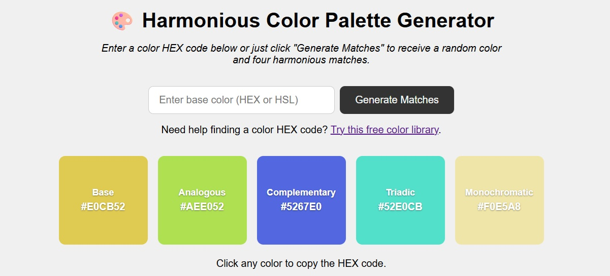

## Harmonious Color Generator 🎨  

A front-end web application that generates harmonious color schemes using HTML, CSS, and JavaScript. Users can explore combinations for design projects, web layouts, or personal inspiration.  

**Features**
* Generates color palettes dynamically with JavaScript.  
* Displays color values (hex/RGB) for easy use in projects.  
* Responsive design with clean HTML/CSS layout.  
* Lightweight, browser-based — no backend required.  

**Tech Stack**
* HTML – structure  
* CSS – styling and layout  
* JavaScript – logic and color generation  

**How to Run**  
Run it in your browser at [this link on GitHub Pages](https://cvcpatton.github.io/color-generator/index.html).  
🌐 Live Demo  

**Sample Output**

